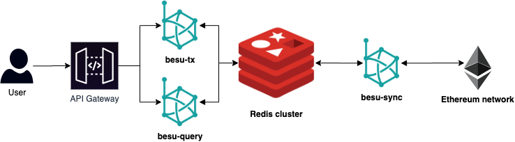

# Hyperledger Besu Redis Plugin

- [Hyperledger Besu Redis Plugin](#hyperledger-besu-redis-plugin)
  * [Overview](#overview)
  * [Architecture](#architecture)
    + [Usage](#usage)
      - [Start Redis server.](#start-redis-server)
      - [Build Redis plugin](#build-redis-plugin)
      - [Start Besu with the redis storage plugin.](#start-besu-with-the-redis-storage-plugin)
    + [Troubleshooting](#troubleshooting)
      - [Host directory for the volume](#host-directory-for-the-volume)
      - [Get the root context by using $. e.g.](#get-the-root-context-by-using---eg)
      - [Find IP address where 'string' is `container_id`](#find-ip-address-where--string--is--container-id-)
  * [License](#license)
  

## Overview

Using a Redis cluster as a storage engine for Besu enables to specify multiple types of Besu nodes depending on the features. This approach would allow us to have optimized nodes for query the database. RocksDB's lock mechanism makes harder to have multiple instances of Besu accessing the same database. Redis on the other hand enables this use case, we can imagine a categorisation of Besu nodes like the following:

- **besu-tx**: Handling of local transaction pool.
- **besu-sync**: Handling of blockchain synchronisation through Ethereum P2P network.
- **besu-query**: Handling of database queries.

## Architecture



### Usage

#### Start Redis server.

Using docker compose:

```shell script
docker-compose -f ./docker/redis.yml up -d
```

Redis + Web UI

```shell script
docker-compose -f ./docker/redis.yml -f ./docker/redis-ui.yml up -d
```

Go to http://127.0.0.1:8081

Remove Redis volume:

```shell script
docker volume rm -f docker_redis_data
```

#### Build Redis plugin

```shell script
./gradlew assemble
```

#### Start Besu with the redis storage plugin.

```shell script
./besu.sh --key-value-storage=redis-storage --plugin-redis-storage-host=localhost --plugin-redis-storage-port=6379
```

### Troubleshooting
```bash
$ docker inspect -f ' ' $(docker ps -aq)
```
#### Host directory for the volume
```bash
$ docker inspect -f '' <volume_name>
 ```
#### Get the root context by using $. e.g.
```bash
$ docker inspect -f '  has pid  ' jenkins
```
 
#### Find IP address where 'string' is `container_id`
```bash
$ docker inspect -f '{{.NetworkSettings.IPAddress}}' aac0b8ed4af6
```
 
## License 

SEE LICENSE 

